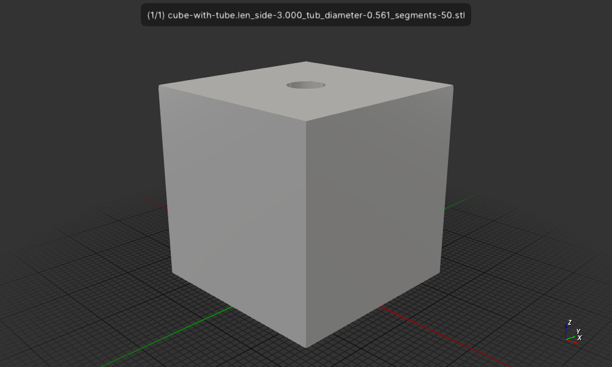

# Cube with a tube in the center

Create a cube with a hollow tube but in the center

## Install

```
cargo install --path .
```
## Usage

```
$ cube-with-tube
Usage: cube-with-tube len_side tube_diameter tube_segments
```

## Run

Create a cube with a tube in the center with the following dimensions:
```
$ cargo run 3 0.561 50
```

or if installed

```
$ cargo-with-tube 3 0.561 50
```

Display the spindle in a 3D viewer.
```

$ f3d cube-with-tube.len_side-3.000_tub_diameter-0.561_segments-50.stl
```

Create a png image of the spindle.
```
$ f3d cube-with-tube.len_side-3.000_tub_diameter-0.561_segments-50.stl --output cube-with-tube.len_side-3.000_tub_diameter-0.561_segments-50.stl.png 
```



## License

Licensed under either of

- Apache License, Version 2.0 ([LICENSE-APACHE](LICENSE-APACHE) or http://apache.org/licenses/LICENSE-2.0)
- MIT license ([LICENSE-MIT](LICENSE-MIT) or http://opensource.org/licenses/MIT)

### Contribution

Unless you explicitly state otherwise, any contribution intentionally submitted
for inclusion in the work by you, as defined in the Apache-2.0 license, shall
be dual licensed as above, without any additional terms or conditions.
