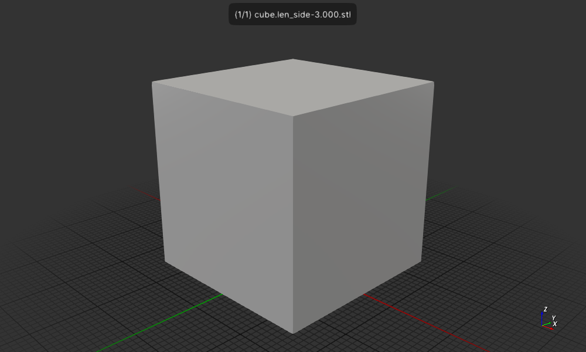

# Cubes

Create one or more cubes with an optional tube in the center

## Install

```
cargo install --path .
```
## Usage

```
wink@3900x 25-03-20T03:00:52.949Z:~/data/prgs/3dprinting/cube-with-tube (main)
$ cubes --help
Create one or more cubes with an optional tube in the center

Usage: cubes [OPTIONS] <LEN_SIDE>

Arguments:
  <LEN_SIDE>

Options:
  -c, --cube-count <CUBE_COUNT>
          The number of cubes to create [default: 1]
  -m, --min-tube-diameter <MIN_TUBE_DIAMETER>
          The minimum diameter of the tube in mm, 0 for no tube [default: 0.0]
  -t, --tube-diameter-step <TUBE_DIAMETER_STEP>
          The number mm's to increase the tube diameter by when there are multiple cubes [default: 0.0]
  -s, --segments <SEGMENTS>
          The number of segments to use when creating the tube, minimum is 3 [default: 50]
  -n, --no-diameter-text
          Don't include text for the tube diameter on the object
  -h, --help
          Print help
  -V, --version
          Print version
```

## Run

### Create one cube

Create one cube
```
$ cargo run 3
```

or if installed

```
$ cubes 3
```

Display the cube in a 3D viewer.
```
$ f3d cube.len_side-3.000.stl
```

Create a png image of the cube.
```
$ f3d cube.len_side-3.000.stl --output cube.len_side-3.000.stl.png
```



### Create one cube with a tube

Create one cube 3mm on a side with a triangular tube inscribed in a 0.561 circle:
```
$ cargo run 3 -m 0.561 -s 3
```

or if installed

```
$ cubes 3 -m 0.561 -s 3
```

Display the cube in a 3D viewer.
```
$ f3d cube-with-tube.len_side-3.000_tube_diameter-0.561_segments-3.stl
```

Create a png image of the cube.
```
$ f3d cube-with-tube-0.len_side-3.000_tube_diameter-0.561_segments-3.stl --output cube-with-tube-0.len_side-3.000_tube_diameter-0.561_segments-3.stl.png
```


### Print mulitple cubes with tubes in the center

Here we create 5 cubes with a 2.397 side length and a tube diameter of 0.561.
The tube diameter is increased by 0.017 which is the resolution of my printer.

I've chosen the physical dimension numbers 2.397, 0.561 and 0.017 as they are
multiples of 0.017, which is the resolution of the 3D printer.
The range of diameters is 0.561 to 0.629 and one of these should nicely fit
straight pin in the tube. The pin with a diameter of 0.629 was loose at first
but after two days the it is not a little tight. So apparently it has shrunk
a little. These have not yet been cured with UV light so I need to do that
and also do it right after washing to see/feel the difference.

Also, I need to actually measure the pin diameters there are at least two
different sizes. The pinkish pins are slightly smaller in diameter than the
other pins.

```
cargo run 2.397 -m 0.561 -s 50 -c 5 -t 0.017
```

Here are some pics of the cubes taken at 2x (focal len 2.4 mm) optical zoom with my Pixel 7a.

This is a pic via a microscope using the 10x objective and 2x
primary lens, IIRC.


5 cubes on 1 pin:


5 cubes on 5 pins:


## License

Licensed under either of

- Apache License, Version 2.0 ([LICENSE-APACHE](LICENSE-APACHE) or http://apache.org/licenses/LICENSE-2.0)
- MIT license ([LICENSE-MIT](LICENSE-MIT) or http://opensource.org/licenses/MIT)

### Contribution

Unless you explicitly state otherwise, any contribution intentionally submitted
for inclusion in the work by you, as defined in the Apache-2.0 license, shall
be dual licensed as above, without any additional terms or conditions.
